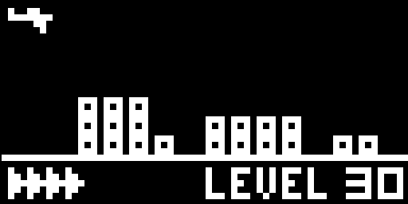

# [Chip8 Emulator](https://github.com/Zemido/Chip8)
This is a Chip8 emulator written in Typescript, with an example minigame is provided as PoC.
The overall behavior of the emulator follows the descriptions from [Cowgod's techical reference](http://devernay.free.fr/hacks/chip8/C8TECH10.HTM).
The bomber minigame is written in a homemade dialect with some syntactic sugar to help with the editing of new programs, and it is explained below. The program is first translated into a regular binary before being fed to the emulator.

You can try the Bomber minigame directly [here](https://zemido.github.io/Chip8/c8.html).
The 'A' key the game uses is in fact the 'Z' key on your regular QWERTY keyboard, see next section on the keys layout. Touching the screen will also work on smartphone.

## Keys layout
The usual Chip8 Keys layout is like this:
<table>
<tbody>
<tr>
<td>1</td>
<td>2</td>
<td>3</td>
<td>C</td>
</tr>
<tr>
<td>4</td>
<td>5</td>
<td>6</td>
<td>D</td>
</tr>
<tr>
<td>7</td>
<td>8</td>
<td>9</td>
<td>E</td>
</tr>
<tr>
<td>A</td>
<td>0</td>
<td>B</td>
<td>F</td>
</tr>
</tbody>
</table>

Here the emulator uses the same layout, using the keys from the left side of the keyboard:
<table>
<tbody>
<tr>
<td>1</td>
<td>2</td>
<td>3</td>
<td>4</td>
</tr>
<tr>
<td>Q</td>
<td>W</td>
<td>E</td>
<td>R</td>
</tr>
<tr>
<td>A</td>
<td>S</td>
<td>D</td>
<td>F</td>
</tr>
<tr>
<td>Z</td>
<td>X</td>
<td>C</td>
<td>V</td>
</tr>
</tbody>
</table>

The emulator is locale agnostic, so it should work with any keyboard layout.

## Other controls
* Start: Starts the emulator. Clinking again on the button resets the program.
* Pause/Resume: Pause or resume the execution.
* Step: When the emulator is paused, clinking this executes only the current instruction.
* Toggle debug: Display the debug panel, which shows the contents of registers, stack, and the sprite representation of memory.
* Sound: Toggles the buzzer.

## Homemade dialect
No custom instruction is used: as is, all the dialect does is making the code readable, with some syntactic sugar:
* Comments start with ';'.
* Constants start with '$'. If it is followed by a number, sets the constant to this number.
* Labels end with ':'. They are both code labels and a memory address.
* Gotos start with '@'. They work with the labels.
* Litteral hexadecimal start with '#'. It is used to put litteral binary data inside the code, and can be used to put sprites or buffer zones.
* Multiple instructions can be on the same line, they just need to be separated by a '|'.
You can check the content of [bomber.js](https://zemido.github.io/Chip8/bomber.js) to check how this is used.
